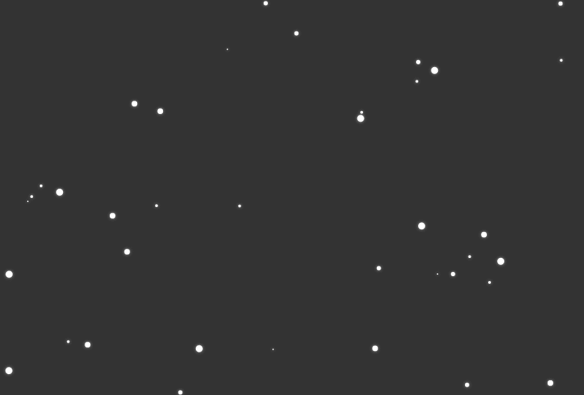

# JavaScript canvas 实现雪花下落效果

## 效果



## 使用

```html
<script src="./src/snow.js"></script>
<script>
  const snow = new Snow()
</script>
```

## 参数

`Snow()` 支持一个参数 `options`，`options` 是一个对象：

| 参数             | 描述                                                             | 类型     | 默认值     | 备注                                                               |
| ---------------- | ---------------------------------------------------------------- | -------- | ---------- | ------------------------------------------------------------------ |
| count            | 雪花数量                                                         | number   | 100        | -                                                                  |
| radiusRange      | 雪花半径范围                                                     | number[] | [1, 5]     | 雪花半径大小随机，如果需要雪花大小一致，指定两个相同的值即可       |
| horizontalSpeeds | 雪花水平方向速度范围，正数表示向右，负数表示向左，0 表示垂直下落 | number[] | [0, 20]    | 雪花下落的水平速度随机，如果需要下落速度一致，指定两个相同的值即可 |
| fallSpeeds       | 雪花下落速度范围                                                 | number[] | [100, 200] | 雪花下落的垂直速度随机，如果需要下落速度一致，指定两个相同的值即可 |
| color            | 雪花颜色                                                         | string   | '#fff'     | -                                                                  |
| shadowColor      | 阴影颜色                                                         | string   | '#aaa'     | -                                                                  |
| shadowBlur       | 模糊阴影半径                                                     | number   | 4          | -                                                                  |

例如：

```js
const snow = new Snow({
  radiusRange: [4, 4], // 雪花半径统一为4
  horizontalSpeeds: [0, 0], // 雪花水平速度统一为0
  fallSpeeds: [200, 200] // 雪花垂直速度统一为200
})
```
